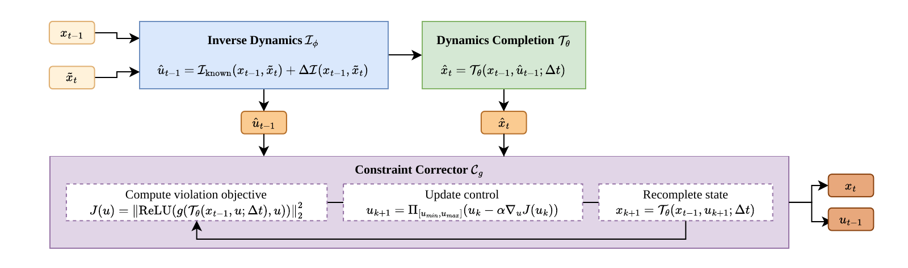

# Markovian Dynamics Enforcer: Feasibility Preserving Correction on Learned Dynamics Manifolds

Kevin Yu<sup>1</sup>, Tao Guo<sup>2</sup>, Constantinos Antoniou<sup>2</sup>, Panagiotis Angeloudis<sup>1</sup>

<sup>1</sup>Imperial College London, UK &nbsp; <sup>2</sup>Technical University of Munich, Germany

<p align="center">
  <a href="https://arxiv.org/abs/2609.39888"></a>
  <a href="https://neurips.cc/virtual/2026/poster/XXXXX"></a> <!-- TODO: replace -->
  <a href="LICENSE"></a>
  <a href="pyproject.toml"></a>
  <a href="https://github.com/jax-ml/jax"></a>
</p>

MaDE is a time-invariant post-hoc operator that maps state-transition proposals onto a learned
feasible dynamics manifold, trained on feasible states without ground-truth controls. For each
transition it infers a control, recomputes the state through a completion model of known
physics plus a learned residual, and corrects that control by gradient-based inequality
reduction.

<p align="center">
  
  <br>
  <em>Overview of the MaDE cell. The control update is drawn with zero momentum.</em>
</p>

## Installation

```bash
git clone https://github.com/tsl-imperial/MaDE.git && cd MaDE
bash setup.sh                     # needs uv; macOS / CPU
uv sync --frozen --extra cuda12   # or: Linux, CUDA 12 (versions used for the paper)
uv run pytest                     # smoke test: fast CPU tier; `uv run pytest -m slow` for end-to-end
```

Prefix the commands below with `uv run`, or activate `.venv` first.

MaDE runs in float64 only. Every entry-point script sets
`jax.config.update("jax_enable_x64", True)` at startup. Do the same in your own code.

## Using MaDE with your own predictor

From the repository root, train a MaDE model, here on the kinematic bicycle:

```bash
uv run python scripts/sim/generate_data.py --system kinematic_bicycle --seed 0
uv run python scripts/sim/run_matrix.py --systems kinematic_bicycle --variants made --seeds 0
```

Then correct a predicted trajectory with the frozen model:

```python
import jax
jax.config.update("jax_enable_x64", True)
import jax.numpy as jnp

from made.upstream import apply_made_trajectory
from made.utils import CheckpointManager

ckpt = "outputs/sim/runs/kinematic_bicycle/fully-specified/made/seed0/checkpoints"
made = CheckpointManager(ckpt).restore().model  # frozen MaDE cell

x0 = jnp.array([0.0, 0.0, 0.0, 5.0])  # last observed state (x, y, theta, v)
steps = jnp.arange(1, 16)[:, None]
x_pred = x0 + steps * jnp.array([0.5, 0.0, 0.0, 0.0])  # your predictor's [T, 4] output
params = jnp.array([2.7])  # known physics parameters (wheelbase L)

x_made = apply_made_trajectory(
    made, x_pred, params, dt=0.1, correction_mode="eval_adaptive", x0=x0
)  # corrected states, [T, 4]
```

`apply_made_trajectory_with_controls` takes the same arguments and also returns the corrected
controls. inD models load with `made.models.MaDEModel.from_checkpoint(path)`. Their physics
parameters come from vehicle metadata through `made.params_from_metadata(metadata)`, and their
step is `dt=0.2`.

## Reproducing the paper

### Data

**Simulated systems.** Generated locally by the first step of `scripts/sim/run_all.sh`
(`scripts/sim/generate_data.py --system all --seed 0`). Output goes to
`data/generated/`. Dynamic-bicycle controls are sampled in ±0.2 rad and ±1.5 m/s², inside the
±0.5 rad and ±3.0 m/s² constraint box (`configs/sim/data_generation.json`).

**inD.** We do not redistribute inD. Request access from levelXdata at
https://levelxdata.com/ind-dataset/. The dataset is licensed for non-commercial research use.
Place the contents of the dataset's `data/` directory in `data/inD-raw/`, then run:

```bash
uv run python scripts/ind/preprocess.py --raw-dir data/inD-raw --output-dir data/inD-preprocessed
```

This writes `data/inD-preprocessed/v1`, which every inD command reads.

### Commands

Run from the repository root. Each `run_all.sh` runs its full pipeline in order: data, training,
scoring, then tables. The inD preprocessing step is commented out in `scripts/ind/run_all.sh`
because it needs your raw data.

```bash
uv run bash scripts/sim/run_all.sh   # simulated systems, CPU
uv run bash scripts/ind/run_all.sh   # inD, GPU
```

| Paper item | Produced by | Output |
|---|---|---|
| Table 1: simulated results | `scripts/sim/run_all.sh`: `run_matrix.py --seeds 0,1,2,3,4`, `train_fab.py` per system and seed, `score_all.py --seeds 0,1,2,3,4`, `build_tables.py` | `outputs/tables/tab_e01_results.tex` |
| Table 2: inD results | `scripts/ind/run_all.sh`: `train_made.py` (seeds 0–2), `train_predictor.py` (3 families × seeds 0–4), `tune_smoother.py`, `evaluate.py --smoother-noise outputs/ind/smoother_noise.json`, `build_table_main.py` | `outputs/tables/tab_e05_ind.tex` |
| Table 3: ablations | `scripts/sim/build_tables.py` | `outputs/tables/tab_e01_ablations.tex` |
| Table 5: control recovery | `scripts/sim/control_recovery.py --seeds 0,1,2,3,4` (run by `scripts/sim/run_all.sh` after `score_all.py`) | `outputs/tables/tab_control_recovery.tex`, `outputs/sim/control_recovery.json` |
| Table 6: runtime | `scripts/ind/measure_latency.py --idle-devices 0 --smoother-noise outputs/ind/smoother_noise.json` | `outputs/ind/latency.json` |
| Table 8: gradient depth | `scripts/ind/gradient_depth_probe.py` (arguments as in `scripts/ind/run_all.sh`) | `outputs/ind/grad_norm_probe.json` |
| Tables 9 and 10: inD inequality breakdown | `scripts/ind/build_table_breakdown.py` | `outputs/tables/tab_ineq_breakdown_ind_{rate,magnitude}.tex` |
| Table 11: completion-only variant | `scripts/ind/evaluate_completion_only.py`, `scripts/ind/build_table_completion_only.py` | `outputs/tables/tab_completion_only.tex` |
| Corrector iteration counts (Section 5, Appendix) | `scripts/ind/corrector_iterations.py` | `outputs/ind/corrector_iterations.json` |
| Prior-only comparator (Appendix) | `scripts/sim/build_tables.py` | `prior_only_comparison` in `outputs/tables/tab_e01_seed_level.json` |
| Per-model breakdown (Appendix) | `scripts/ind/evaluate.py` | `outputs/ind/panel.json` |

Figures 1 and 2 are drawings. Tables 4 and 7 list metric definitions and default
hyperparameters. None of the four has associated code. Run `measure_latency.py` alone on an
idle GPU: it measures wall-clock time.

The simulated tables are built from a separate scoring pass (`score_all.py`), not from the
evaluation that `run_matrix.py` writes next to each checkpoint. To rebuild the tables from
existing scores:

```bash
uv run python scripts/sim/build_tables.py
uv run python scripts/ind/build_table_main.py
uv run python scripts/ind/build_table_breakdown.py
uv run python scripts/ind/build_table_completion_only.py
```

## Citation

<!-- TODO: replace with the NeurIPS 2026 @inproceedings entry -->
```bibtex
@article{yu2026made,
  title   = {Markovian Dynamics Enforcer: Feasibility Preserving Correction on Learned Dynamics Manifolds},
  author  = {Yu, Kevin and Guo, Tao and Antoniou, Constantinos and Angeloudis, Panagiotis},
  journal = {arXiv preprint arXiv:2609.39888},
  year    = {2026},
}
```

## License

MIT. See [LICENSE](LICENSE). The inD dataset is under its own licence from levelXdata and is not
part of this repository.
